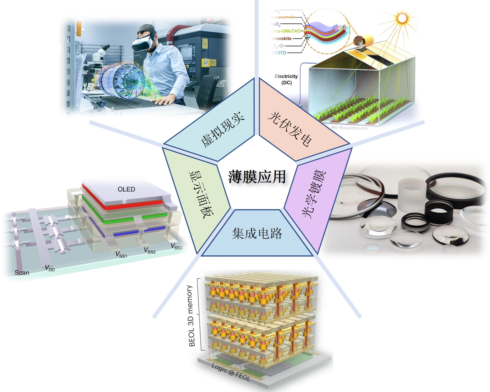
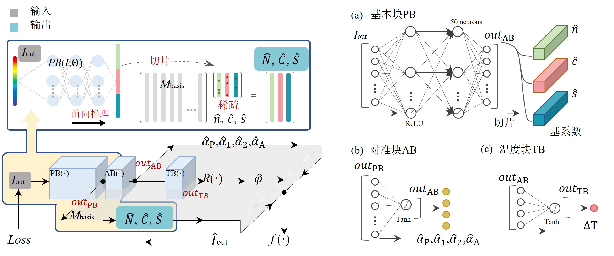
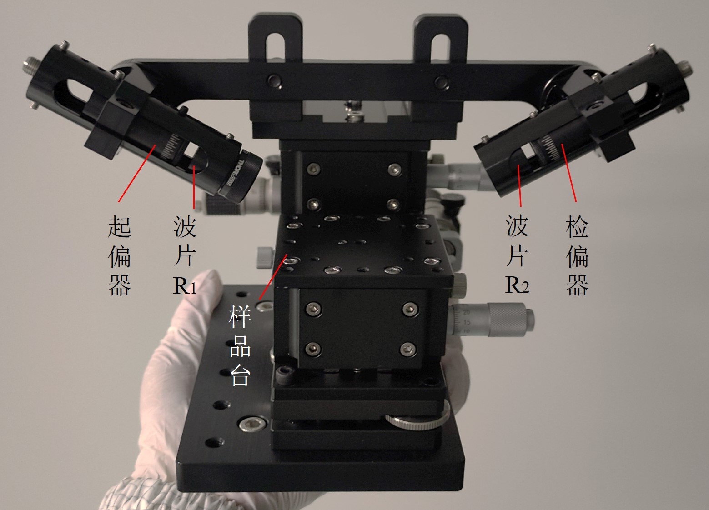
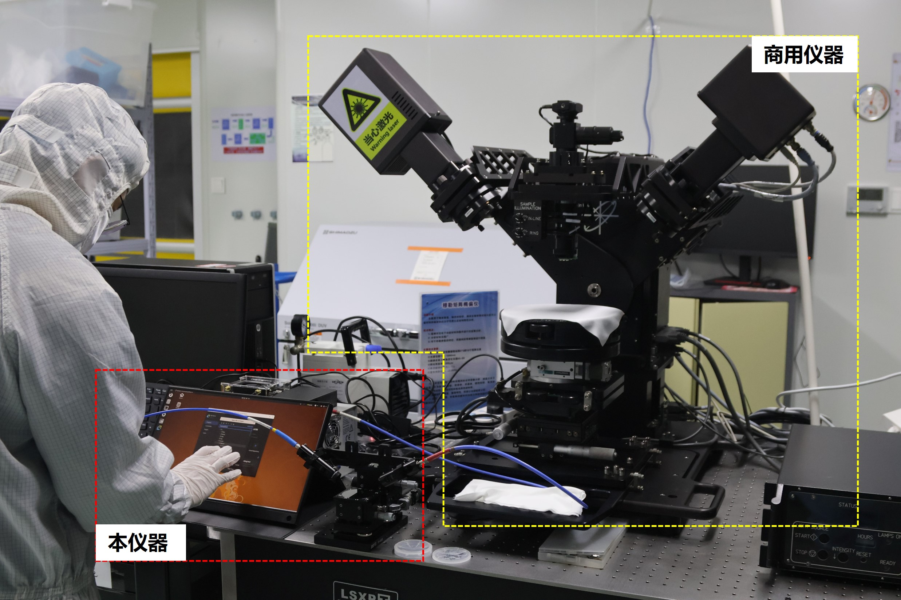
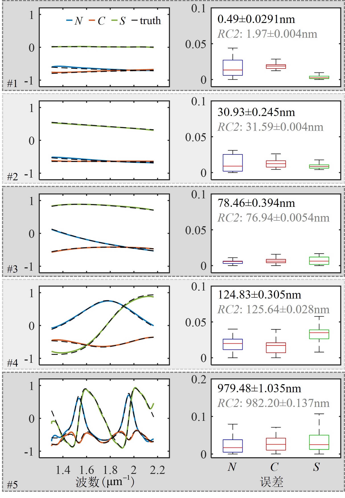
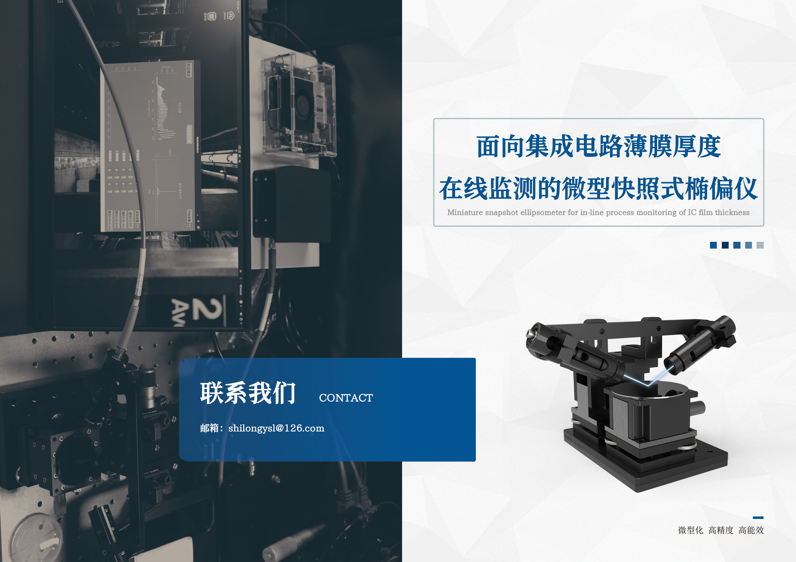

# A-Miniature-Snapshot-Ellipsometer-for-Thin-Films
```html
<span style="font-size: 16px;">
注1：项目的原理、重构算法、微型结构、装调方法、校准算法、初版软件均由ysl (shilongysl@126.com)完成，后续软件开发由yh (hangyue@hust.edu.cn)完成。
注2：演示中测量速度和精度算是下限，因为时间和精力原因，很多地方比较粗糙，后续还会持续进行优化。
注3：在/Experiments/figs中上传了两端演示视频。
</span>
```


```html
<span style="font-size: 24px;">
纳米、亚纳米尺度的功能性薄膜广泛应用于多个关键领域，其在线精确测量对测量仪器提出了无破坏、测速快、精度高、易集成等新需求。目前，椭偏测量技术已成为薄膜测量领域的标准方法，在多种类型的椭偏仪中，快照式椭偏仪因其测量速度快、结构紧凑引起广泛关注，具备实现上述需求的潜力。
</span>
```




```html
<span style="font-size: 24px;">
--------fig1. 功能性薄膜的典型应用场景--------

然而，现有技术在微型化时系统误差显著加剧，经典参数重构算法鲁棒性较差，导致测量精度过分依赖硬件与装调精度，且大多使用个人电脑进行控制、采集和计算，体积较大。针对以上问题，本项目主要的工作及创新点可以概括为微型化、高吞吐、低开销，具体包括：

1. 提出了一种基于物理先验嵌入无训练网络的智能重构算法，无需构建数据集或训练模型，显著降低了算法开销，同时实现了对仪器多种误差的实时补偿，有效提升了测量精度和抗噪性能。此外，大幅减少了对硬件设计的约束，助力实现更简易、更紧凑的仪器结构。
</span>
```




```html
<span style="font-size: 24px;">
--------fig2. 重构算法的原理--------

2. 在此基础上，本文设计并研制了一套微型快照式椭偏仪，通过结构优化、高精度装调与原位同步校准方法、边缘计算设备集成，实现了仪器体积的微型化（约200×50×50 mm³），同时保证了高精度测量。
</span>
```


 

```html
<span style="font-size: 24px;">
--------fig2. 仪器系统的实物图--------

实验验证表明，该仪器在宽波段范围内对各向同性薄膜的Mueller矩阵测量误差小于0.05，厚度测量重复性精度约3%（第一个版本，做的实验还是比较粗糙，后面精度会有更大提升），单次测量时间可达70毫秒（第一个版本，不包含解算时间，后续会更快），为薄膜在线测量提供了全新的技术方案。
</span>
```



```html
<span style="font-size: 24px;">
--------fig3. 仪器对多块薄膜样品的测量结果--------

本项目通过算法与硬件的优化创新，实现了兼顾微型化与高精度的薄膜测量仪器，为薄膜的在线测量提供了高效、紧凑的技术路径。未来，该技术有望进一步应用于复杂薄膜体系的实时监测，并推动测量仪器向智能传感的转变，为相关领域的技术发展提供重要支撑。
</span>
```


 
```html
<span style="font-size: 24px;">
--------fig4. 此项目的整体宣传图--------
</span>
```

